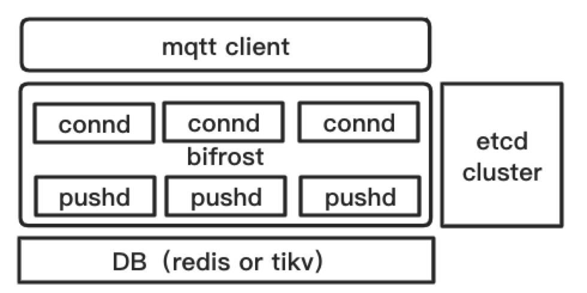

# bifrost
A MQTT message broker based on [MQTT v3.1.1](http://mqtt.org) 

## Why Bifrost?
* Completely compatible with mqtt protocol
* Multi-tenancy support
* No painful scale out
* High availability 
* Flexible business callback

## Support Functions
* Retain message
* QoS 1,0 message
* Will message

## Architecture

## Quick Start
### Building the base environment
#### Etcd
* nohup  etcd > etcd.log 2>&1 &

To setup etcd , please follow official [instruction](https://github.com/etcd-io/etcd)

#### Redis
* nohup redis-server > redis.log 2>&1 &

To setup redis, please follow official [instruction](https://redis.io/)

### Run Bifrost
1. GO111MODULE=on sh release.sh	
2. cd bifrost
3. nohup bin/pushd -c conf/pushd.toml > pushd.log 2>&1 & 
4. nohup bin/connd -c conf/connd.toml > connd.log 2>&1 &

### Test
1. cd misc/example/ && go build 
2. ./message_test_a2a 

## Example
You can refer to directory 1 (misc/linktest) and directory 2 (misc/example)
